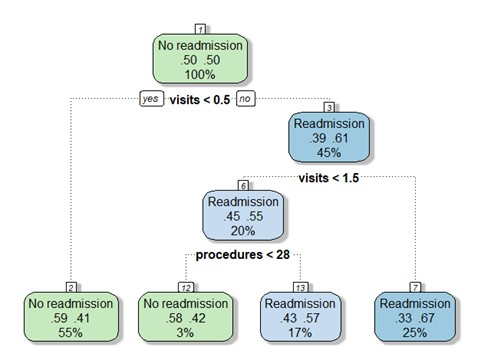

# Diabetes-Readmission-Classification
Using classification methods to predict hospital readmission for diabetic patients

## Summary:
* Dataset consists of 10 years of diabetic patients' data in the U.S., along with whether or they not they were readmitted to the hospital (Unbalanced classes with ~75% not readmitted)
* Data was cleaned and many of the features were recoded/engineered
* Multiple classification models were compared using R (Logistic Regression, SVM, Decision Tree, Random Forest) on the basis of AUC and K-Means Clustering was performed as well
* Logistic regression was found to be the best performing model (AUC = 0.615)

## References:
* [Research Paper from dataset creators](https://www.hindawi.com/journals/bmri/2014/781670/)

### Data Cleaning:
- The initial dataset has 101,766 rows and 50 attributes. First, we checked for missing values upon importing the data into R. 


| |
|:--:| 
| *Columns with missing values* |

- Weight, payer_code, and medical_specialty were dropped since they were missing > 40% of their data 
- Dropped only the missing rows for other columns 
- Dropped one row which had a value for gender = "Invalid"
- Kept only each patient's first hospital visit, dropped any follow-up visits

### Feature Engineering:

- Created buckets for many categorical features to reduce number of distinct values
- Combined 3 features (number of outpatient, inpatient, and emergency room visits) into 1 feature called "total visits"
- Dropped or recoded most features describing medication due to lack of variance
- Converted "age" variable from 10 age groups to just 3: {[0,30), [30,60), >60}
- Recoded target variable (Readmitted) from 3 values (>30 day readmission, <30 day readmission, No readmission) into a binary ("Readmission", "No Readmission")

### Logistic Regression:

- Undersampling used to balance data while maintaining independence of samples
- Backward selection employed for feature selection using step() function from stats package
``` R
lr_all = glm(readmitted~.,data=train_data,family='binomial')
backward <- step(lr_all, direction = 'backward')                                                          
```

**Logistic Regression Results:**
| Metric  | Value   |                                               
|---|---|
| Accuracy  |  0.643522 |
| Sensitivity  |  0.750103 |
| Specificity  |  0.321853 |
| Precision | 	0.769496  |
| AUC| 0.615|


| |
|:--:| 
| *ROC for Logistic Regression* |


### Decision Tree:
- Oversampling used to balance classes
- Complexity parameter cp tuned using 10-fold cross validation


| |
|:---:|
|*Decision Tree*|


**Decision Tree Results:**
| Metric  | Value   |
|---|---|
| Accuracy  |  0.650898 |
| Sensitivity  |  0.692206 |
| Specificity  |  0.526716|
| Precision | 	0.814704  |
| AUC| 0.607|                                       


| |
|:---:|
|*Decision Tree ROC*|

### Support Vector Machine:
- Oversampling used to balance classes
- Recursive feature elimination used for variable selection
- Additional validation set created to tune hyperparamters (cost and gamma) using grid search before deploying on test set

**Support Vector Machine Results:**
| Metric  | Value   |
|---|---|
| Accuracy  |  0.643522 |
| Sensitivity  | 0.750103|
| Specificity  | 0.321853|
| Precision | 	0.769496  |
| AUC| 0.536|    


| |
|:---:|
|*Support Vector Machine ROC*|

### Random Forest:
- Oversampling used to balance classes
- Hyperparamter *mtry* (representing number of variables randomly sampled at each node) tuned using 5-fold cross validation

**Random Forest Results:**
| Metric  | Value   |
|---|---|
| Accuracy  |  0.746461 |
| Sensitivity  | 0.925484|
| Specificity  | 0.212345|
| Precision | 	0.778052  |
| AUC| 0.569|    


| |
|:---:|
|*Random Forest ROC*|

### K-means Clustering:
- Converted all categorical features using one-hot encoding
- Standardized variables since the algorithm is reliant on distance
- First used a value of K=2 and plotted the results on two dimensions using PCA


| |
|:---:|
|*K-means Clustering plot with K=2*|


- Tuned the value of K using within-cluster sum of squares

| |
|:---:|
|*WSS for different values of K*|
